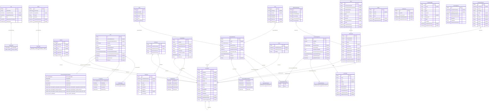

```mermaid
erDiagram

        IdentityType {
            CONSUMER CONSUMER
NOBA_ADMIN NOBA_ADMIN
        }
    


        KYCStatus {
            NOT_SUBMITTED NOT_SUBMITTED
PENDING PENDING
APPROVED APPROVED
FLAGGED FLAGGED
REJECTED REJECTED
        }
    


        DocumentVerificationStatus {
            NOT_REQUIRED NOT_REQUIRED
REQUIRED REQUIRED
PENDING PENDING
APPROVED APPROVED
REJECTED REJECTED
REJECTED_DOCUMENT_REQUIRES_RECAPTURE REJECTED_DOCUMENT_REQUIRES_RECAPTURE
REJECTED_DOCUMENT_POOR_QUALITY REJECTED_DOCUMENT_POOR_QUALITY
REJECTED_DOCUMENT_INVALID_SIZE_OR_TYPE REJECTED_DOCUMENT_INVALID_SIZE_OR_TYPE
LIVE_PHOTO_VERIFIED LIVE_PHOTO_VERIFIED
        }
    


        WalletStatus {
            PENDING PENDING
FLAGGED FLAGGED
REJECTED REJECTED
APPROVED APPROVED
DELETED DELETED
        }
    


        PaymentMethodType {
            CARD CARD
ACH ACH
        }
    


        PaymentProvider {
            CHECKOUT CHECKOUT
        }
    


        PaymentMethodStatus {
            FLAGGED FLAGGED
REJECTED REJECTED
APPROVED APPROVED
UNSUPPORTED UNSUPPORTED
DELETED DELETED
        }
    


        KYCProvider {
            SARDINE SARDINE
        }
    


        TransactionType {
            NOBA_WALLET NOBA_WALLET
        }
    


        TokenType {
            REFRESH_TOKEN REFRESH_TOKEN
        }
    
  Consumer {
    String id PK 
    String firstName  "nullable"
    String lastName  "nullable"
    String email  "nullable"
    String displayEmail  "nullable"
    String handle  "nullable"
    String referralCode  
    String phone  "nullable"
    String locale  "nullable"
    String dateOfBirth  "nullable"
    Boolean isLocked  
    Boolean isDisabled  
    DateTime createdTimestamp  "nullable"
    DateTime updatedTimestamp  "nullable"
    String socialSecurityNumber  "nullable"
    }
  

  Address {
    String id PK 
    String streetLine1  "nullable"
    String streetLine2  "nullable"
    String city  "nullable"
    String countryCode  
    String regionCode  "nullable"
    String postalCode  "nullable"
    }
  

  KYC {
    String id PK 
    String kycCheckReference  "nullable"
    String documentCheckReference  "nullable"
    KYCProvider provider  
    String riskRating  "nullable"
    Boolean isSuspectedFraud  
    KYCStatus kycCheckStatus  
    DocumentVerificationStatus documentVerificationStatus  
    DateTime documentVerificationTimestamp  "nullable"
    DateTime kycVerificationTimestamp  "nullable"
    String sanctionLevel  "nullable"
    String riskLevel  "nullable"
    }
  

  Employer {
    String id PK 
    DateTime createdTimestamp  "nullable"
    DateTime updatedTimestamp  "nullable"
    String name  
    String logoURI  
    String referralID  
    String bubbleID  
    Int leadDays  "nullable"
    Int payrollDays  
    }
  

  Employee {
    String id PK 
    DateTime createdTimestamp  "nullable"
    DateTime updatedTimestamp  "nullable"
    Float allocationAmount  
    String allocationCurrency  
    }
  

  CryptoWallet {
    String id PK 
    String address  
    DateTime createdTimestamp  "nullable"
    DateTime updatedTimestamp  "nullable"
    String name  "nullable"
    String chainType  "nullable"
    Boolean isEVMCompatible  "nullable"
    WalletStatus status  
    Float riskScore  "nullable"
    }
  

  PaymentMethod {
    String id PK 
    String name  "nullable"
    PaymentMethodType type  
    String paymentToken  
    DateTime createdTimestamp  "nullable"
    DateTime updatedTimestamp  "nullable"
    PaymentProvider paymentProvider  
    PaymentMethodStatus status  
    Boolean isDefault  
    String imageUri  "nullable"
    }
  

  Card {
    String id PK 
    String cardType  "nullable"
    String scheme  "nullable"
    String first6Digits  
    String last4Digits  
    String authCode  "nullable"
    String authReason  "nullable"
    }
  

  ACH {
    String id PK 
    String accountID  
    String accessToken  
    String itemID  
    String mask  
    String accountType  
    }
  

  Circle {
    String id PK 
    DateTime createdTimestamp  "nullable"
    DateTime updatedTimestamp  "nullable"
    String walletID  
    }
  

  Otp {
    String id PK 
    String otpIdentifier  
    DateTime createdTimestamp  "nullable"
    DateTime updatedTimestamp  "nullable"
    Int otp  
    DateTime otpExpirationTimestamp  
    IdentityType identityType  
    }
  

  LimitProfile {
    String id PK 
    String name  
    Float daily  "nullable"
    Float weekly  "nullable"
    Float monthly  
    Float maxTransaction  
    Float minTransaction  
    Float unsettledExposure  "nullable"
    DateTime createdTimestamp  "nullable"
    DateTime updatedTimestamp  "nullable"
    }
  

  LimitConfiguration {
    String id PK 
    Boolean isDefault  
    Int priority  
    TransactionType transactionType  "nullable"
    Int minProfileAge  "nullable"
    Float minBalanceInWallet  "nullable"
    Float minTotalTransactionAmount  "nullable"
    PaymentMethodType paymentMethodType  "nullable"
    DateTime createdTimestamp  "nullable"
    DateTime updatedTimestamp  "nullable"
    }
  

  Transaction {
    String id PK 
    String transactionRef  
    String workflowName  
    String status  
    String memo  "nullable"
    String sessionKey  
    String debitCurrency  "nullable"
    String creditCurrency  "nullable"
    Float debitAmount  "nullable"
    Float creditAmount  "nullable"
    Float exchangeRate  "nullable"
    DateTime createdTimestamp  "nullable"
    DateTime updatedTimestamp  "nullable"
    }
  

  TransactionEvent {
    String id PK 
    DateTime timestamp  "nullable"
    Boolean internal  
    String message  
    String details  "nullable"
    String key  "nullable"
    String param1  "nullable"
    String param2  "nullable"
    String param3  "nullable"
    String param4  "nullable"
    String param5  "nullable"
    }
  

  Mono {
    String id PK 
    String monoTransactionID  "nullable"
    String monoPaymentTransactionID  "nullable"
    String collectionLinkID  "nullable"
    String collectionURL  "nullable"
    String type  
    String transferID  "nullable"
    String batchID  "nullable"
    String declinationReason  "nullable"
    String state  
    DateTime createdTimestamp  "nullable"
    DateTime updatedTimestamp  "nullable"
    }
  

  Token {
    String id PK 
    TokenType tokenType  
    DateTime expiryTime  "nullable"
    String userID  
    Boolean isUsed  
    DateTime createdTimestamp  "nullable"
    DateTime updatedTimestamp  "nullable"
    }
  

  Admin {
    String id PK 
    String name  "nullable"
    String email  
    String role  
    DateTime createdTimestamp  "nullable"
    DateTime updatedTimestamp  "nullable"
    }
  

  Verification {
    String id PK 
    String userID  "nullable"
    String transactionID  "nullable"
    DateTime createdTimestamp  "nullable"
    DateTime updatedTimestamp  "nullable"
    }
  

  CreditCardBIN {
    String id PK 
    String issuer  "nullable"
    String bin  
    String type  
    String network  
    String mask  "nullable"
    String supported  
    Int digits  
    Int cvvDigits  
    DateTime createdTimestamp  "nullable"
    DateTime updatedTimestamp  "nullable"
    }
  

  ExchangeRate {
    String id PK 
    DateTime createdTimestamp  "nullable"
    DateTime updatedTimestamp  "nullable"
    String numeratorCurrency  
    String denominatorCurrency  
    Float bankRate  
    Float nobaRate  
    DateTime expirationTimestamp  
    }
  

  WithdrawalDetails {
    String id PK 
    String bankCode  
    String accountNumber  
    String accountType  
    String documentNumber  
    String documentType  
    }
  
    Consumer o|--|o Consumer : "referredBy"
    Address o|--|| Consumer : "consumer"
    KYC o|--|| KYCProvider : "enum:provider"
    KYC o|--|| KYCStatus : "enum:kycCheckStatus"
    KYC o|--|| DocumentVerificationStatus : "enum:documentVerificationStatus"
    KYC o|--|| Consumer : "consumer"
    Employee o{--|| Employer : "employer"
    Employee o{--|| Consumer : "consumer"
    CryptoWallet o|--|| WalletStatus : "enum:status"
    CryptoWallet o{--|| Consumer : "consumer"
    PaymentMethod o|--|| PaymentMethodType : "enum:type"
    PaymentMethod o|--|| PaymentProvider : "enum:paymentProvider"
    PaymentMethod o|--|| PaymentMethodStatus : "enum:status"
    PaymentMethod o{--|| Consumer : "consumer"
    Card o|--|| PaymentMethod : "paymentMethod"
    ACH o|--|| PaymentMethod : "paymentMethod"
    Circle o|--|| Consumer : "consumer"
    Otp o|--|| IdentityType : "enum:identityType"
    LimitConfiguration o{--|| LimitProfile : "profile"
    LimitConfiguration o|--|o TransactionType : "enum:transactionType"
    LimitConfiguration o|--|o PaymentMethodType : "enum:paymentMethodType"
    Transaction o{--|o Consumer : "debitConsumer"
    Transaction o{--|o Consumer : "creditConsumer"
    TransactionEvent o{--|| Transaction : "transaction"
    Mono o|--|| Transaction : "transaction"
    Token o|--|| TokenType : "enum:tokenType"
    WithdrawalDetails o{--|| Transaction : "transaction"
```
